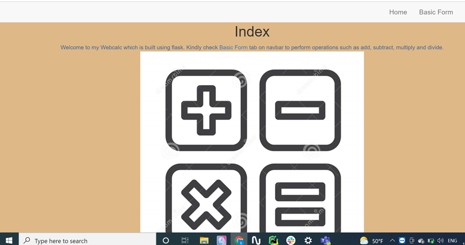
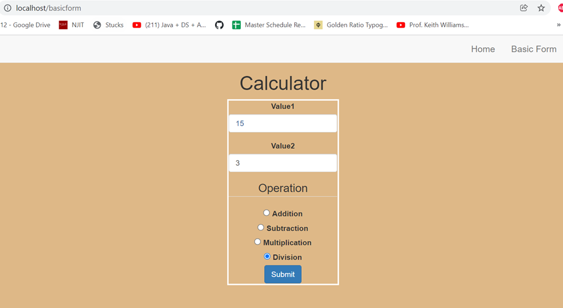
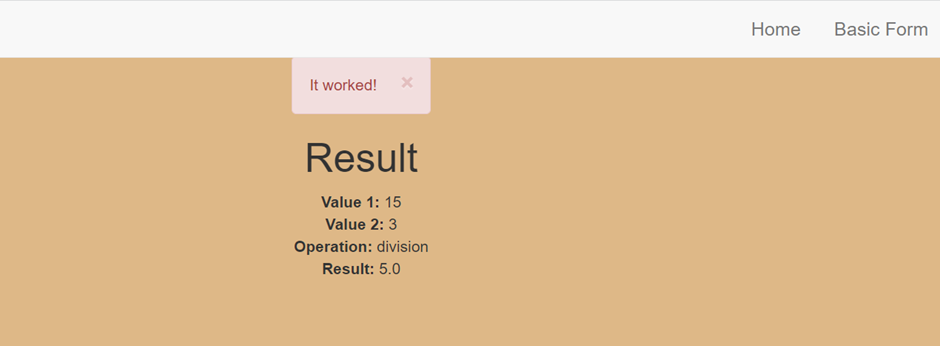
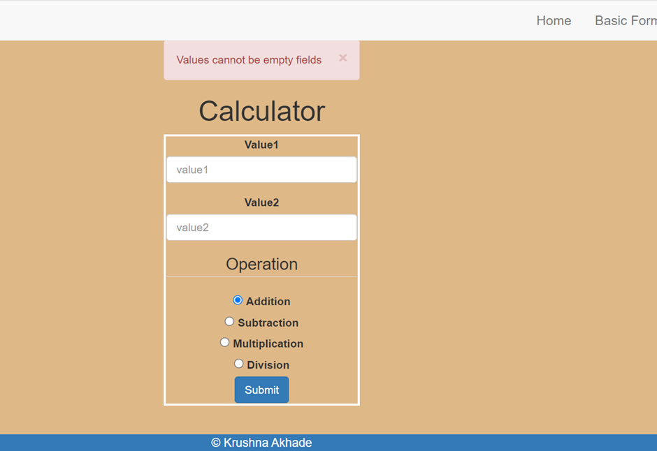

This is a Home page which i have added the Basic Form link in the welcome paragraph itself. 

This is a Basic Form where i am performing Add, Subtract, Mul and Divide option.
For ex, Here i am performing divide operation.

Once clicked on Submit button this will direct to the result.html where it will show the results of operation.

The case when the any of the value field kept empty it returns a flash message.

